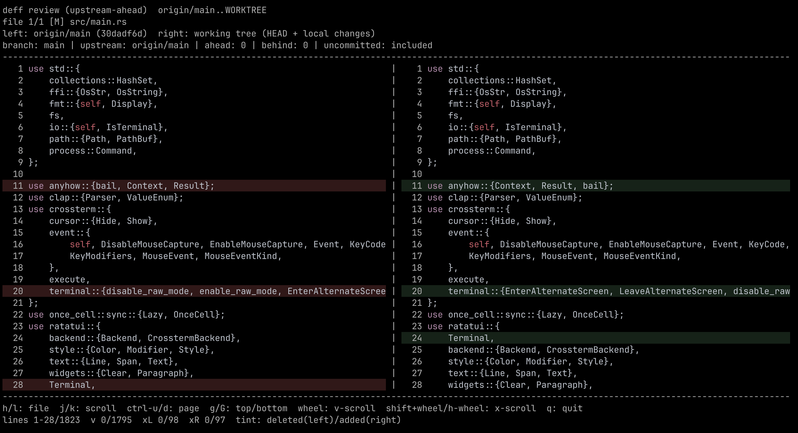
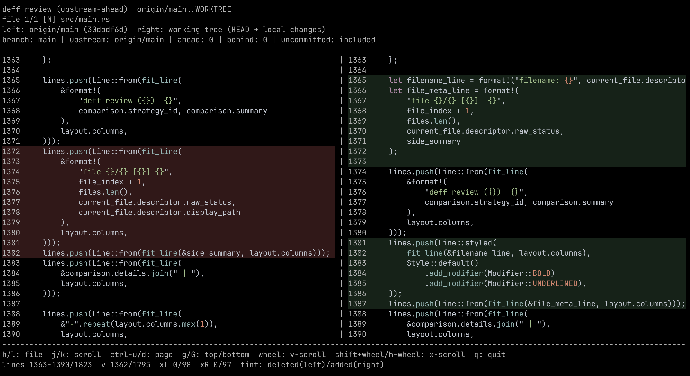

My name is deff

# deff

`deff` is a Rust TUI: interactive, side-by-side file review for git diffs with per-file navigation, vertical and horizontal scrolling, syntax highlighting, and added/deleted line tinting.

## Quickstart

Run the installer script from this repository:

```bash
curl -fsSL https://raw.githubusercontent.com/flamestro/deff/main/install.sh | bash
```

Installer source: https://github.com/flamestro/deff/blob/main/install.sh

The script checks for `cargo`, clones this project into a temporary directory, installs it, and removes the temporary checkout.

If you have local edits (including untracked files) and want to review them before committing, run:

```bash
deff --include-uncommitted
```

This opens the side-by-side review so you can check exactly what changed in your working tree.

## Features

- `upstream-ahead` strategy (default) to compare local branch changes against its upstream
- `range` strategy for explicit `--base` / `--head` comparison
- Optional `--include-uncommitted` mode to include working tree and untracked files
- Side-by-side panes with independent horizontal scroll offsets
- Keyboard and mouse navigation (including wheel + shift-wheel)
- Vim-like motion navigation (`h`/`j`/`k`/`l`, `g`/`G`, `Ctrl+u`/`Ctrl+d`)
- Language-aware syntax highlighting and line-level add/delete tinting

## Examples

Single-line change view:



Multi-line change view:



## Usage

```bash
deff
deff --strategy upstream-ahead
deff --strategy range --base origin/main --head HEAD
deff --strategy range --base origin/main --include-uncommitted
deff --theme dark
```

Show help:

```bash
deff --help
```

## Local Build and Usage Flow

Prerequisites:

- Rust toolchain (`cargo`)
- `git`
- Interactive terminal (TTY)

1. Build locally:

   ```bash
   cargo build --release --locked
   ./target/release/deff --help
   ```

2. Optionally install it to your local Cargo bin path:

   ```bash
   cargo install --path .
   deff --help
   ```

3. Run it inside any git repository you want to review:

   ```bash
   cd /path/to/your/repo

   # default: compare local branch commits vs upstream
   deff

   # explicit range
   deff --base origin/main --head HEAD

   # include uncommitted + untracked files
   deff --base origin/main --include-uncommitted
   ```

If your branch has no upstream configured, use the explicit `--base` flow.

Theme selection:

- By default, `deff` prefers a dark syntax theme (better for black/dark terminals).
- Use `--theme auto|dark|light` to control rendering for your terminal.
- `--theme` takes precedence over `DEFF_THEME=dark|light`.

## GitHub Release Workflow

This repo ships with `.github/workflows/release.yml`.

- Trigger: push a tag like `v0.1.0`
- Builds release artifacts for Linux and macOS targets
- Creates a GitHub release and uploads tarballs + SHA256 files
